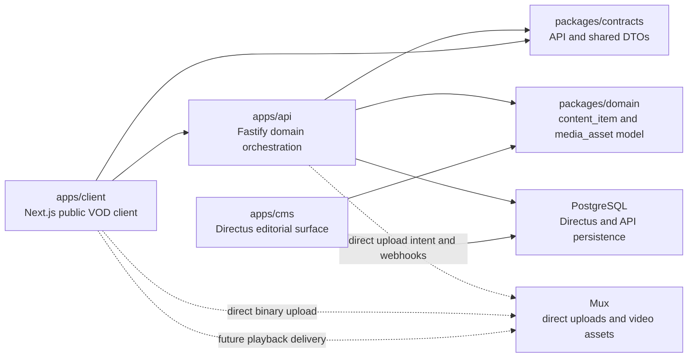

# Architecture

HomeFlix is organized as a decoupled tripartite architecture.

## Layers

`apps/client` is the public consumption surface. It consumes data and contracts prepared by the API. It does not own editorial workflows or technical asset processing state.

`apps/api` is the orchestration layer. It exposes Fastify HTTP contracts, validates inputs, coordinates domain boundaries, creates Mux direct upload intents, verifies webhooks, persists observed technical `MediaAsset` state and exposes basic catalog read contracts. It does not transport video binaries as the primary upload flow.

`apps/cms` is the editorial surface. Directus is adopted as the CMS and stays separate from the public storefront. Directus is the editorial source of truth for `ContentItem`, `Category` and `Collection`. The client never consumes Directus directly.

`packages/domain` contains shared domain types. `ContentItem` represents editorial content. `MediaAsset` represents a technical video asset and its processing lifecycle. `Category`, `Collection`, `Profile` and `WatchHistory` are explicit catalog/support concepts.

`packages/contracts` contains API DTOs and responses. It reduces ambiguity between client, API and future CMS workflows without duplicating business rules.

`packages/config` contains small shared environment and constants utilities.

`packages/types` contains reusable primitives without business semantics.

## Principles

- Separate editorial state from technical state.
- Keep video binaries out of the application backend as the primary upload path.
- Let the API coordinate domain contracts without replacing the CMS.
- Keep Directus as the editorial workspace, not the public storefront.
- Keep Mux as the only video provider through the current foundation phases.
- Avoid fake storefront screens in foundation phases.
