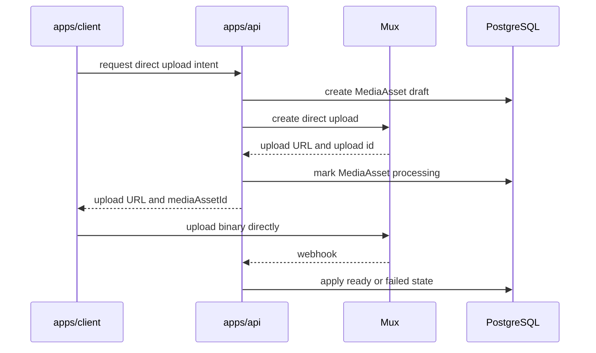
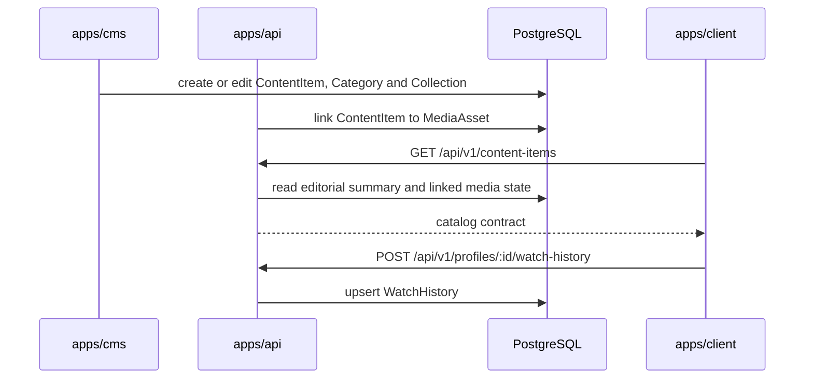

# Service Boundaries

## apps/client

Responsible for:

- Rendering the public consumption shell.
- Consuming contracts exposed by `apps/api`.
- Rendering the FASE 3 technical catalog probe.
- Running the FASE 2 technical direct upload probe.
- Sending selected video files directly to Mux using the upload URL returned by the API.

Not responsible for:

- Editorial workflows.
- Directus reads or writes.
- Technical status ownership.
- Production auth.
- Final playback UI in FASE 3.
- Directus reads for catalog data.

## apps/api

Responsible for:

- Exposing HTTP contracts under `/api/v1`.
- Validating runtime configuration.
- Creating Mux direct upload intents.
- Persisting minimal technical `MediaAsset` state.
- Verifying Mux webhooks.
- Applying centralized technical status transitions.
- Exposing MediaAsset status to the client and future CMS workflows.
- Exposing basic catalog, category, collection, profile and watch-history contracts.
- Coordinating explicit `ContentItem` to `MediaAsset` links.

Not responsible for:

- Transporting video binaries as the primary upload path.
- Replacing Directus as CMS.
- Owning editorial publication state.
- Rendering storefront UI.
- Implementing final production auth or RBAC in FASE 3.
- Replacing Directus as the editorial source of truth.

## apps/cms

Responsible for:

- Editorial and administrative workspace.
- Future `ContentItem` authoring.
- Editorial authoring of `ContentItem`, `Category` and `Collection`.
- Future editorial workflows around association between `ContentItem` and `MediaAsset`.
- Controlling `ContentItem.status`.

Not responsible for:

- Public storefront consumption.
- Video processing state ownership.
- Direct playback delivery.
- Replacing `apps/api` as the public orchestration API.

## FASE 2 Video Flow

The binary does not pass through `apps/api`. The API coordinates intent, provider metadata and observed technical state.

## API vs CMS

`apps/cms` creates and edits editorial content. It controls `ContentItem.status`.

`apps/api` orchestrates permissions, consumption, upload intents, playback contracts, webhooks, catalog reads and profile progress. It persists `MediaAsset.status` as observed from Mux and stores the explicit links needed to connect technical media assets to editorial content.

`apps/client` consumes `apps/api`. It never consumes `apps/cms` directly.

Directus does not publish technical video availability. Mux decides technical processing state and communicates it to the API by webhook.

## FASE 3 Catalog Flow

Directus owns editorial authoring. The API owns public contract shape, technical media state, associations to technical assets and consumption state.
